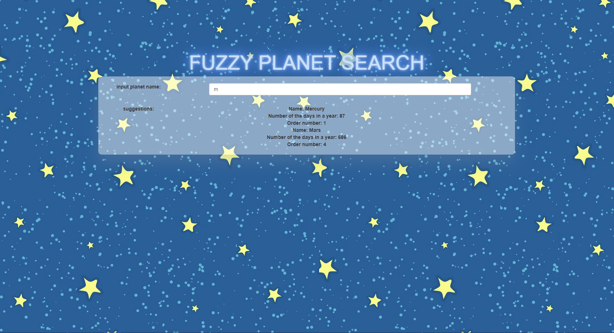
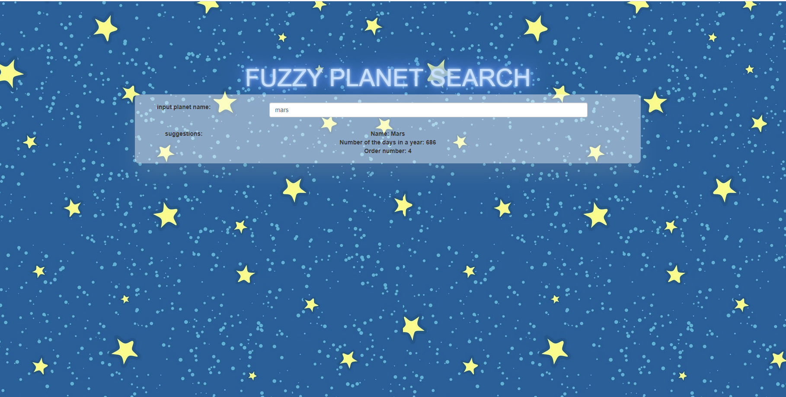

# planet fuzzy search

## html css jquery AJAX php boostrap

## screenshots

## INIT-env:
### 1.Install xampp or wamp
### 2.Download full project, put whole folder in localhost folder (ep. c:/xampp/htdocs/ajaxtest)
### 3. Enter localhost://ajaxtest/clients.html ,use clients.html as the entrance.
## USE
### Enter the planet's name you want to search, you will automatic get details about the plaent.
### For example is you input mars you will get details about mars;If you type m you will get a list of plantes with m in their name. 
